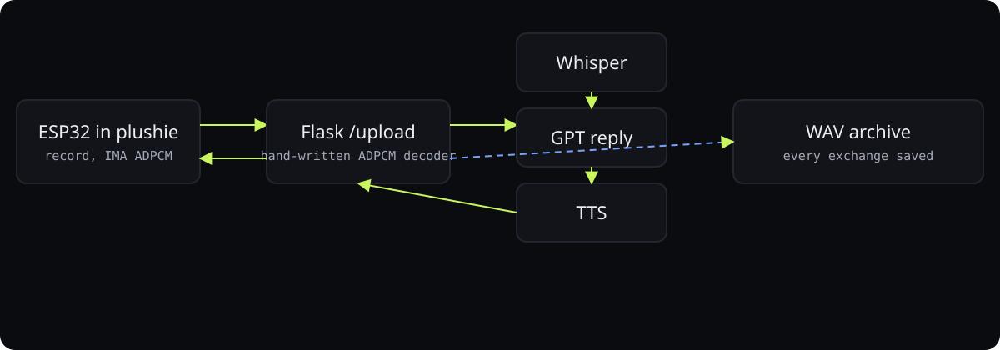

<div align="center">

# Plushie voice toy

**The first voice toy: an ESP32 in a plushie records a question, a Flask server answers with Whisper, GPT, and TTS.**

<p>
<a href="https://ibiraheel.com/p/plushie"></a>
</p>

<p>


</p>

</div>

<br>

> **A plushie that talks back, recorded**  
> for the prototype that became Luno

## What it did

The toy compresses audio to IMA ADPCM to fit the microcontroller's memory, the server decodes it by hand, transcribes it, generates a reply, and sends speech back. The recording below is a real exchange from the July 2025 device test.

<sub>Outcome: measured.</sub>

## How it works

<p align="center"></p>

1. IMA ADPCM at 4 bits per sample halves the upload from a memory-constrained ESP32.
2. Hand-written decoder on the server mirrors the firmware encoder exactly.
3. Plain HTTP upload and download: simplest thing that worked on day one.
4. Every exchange is saved as WAV, which is why a real recording exists.

## Run it locally

**Server** (`server/app.py`): a Flask app that takes the device's recording on `POST /upload`,
transcribes it, writes a reply and returns speech.

```bash
cd server
pip install flask
python app.py   # :5005
```

> [!NOTE]
> The speech-to-text, reply and text-to-speech helpers (`whisper_stt`, `gpt_reply`, `tts`)
> lived on the deployment server and are not in this repo. `app.py` is the complete request
> flow; plug in your own three functions to run it.

**Firmware** (`firmware/`): open the sketch in the Arduino IDE with the ESP32 board package and
flash it. On first boot the device hosts a captive portal to join Wi-Fi, so no credentials live in code.

## Repository layout

```
├── firmware/
│   └── plushiev3_wifi_audio_recording.ino
└── server/
    ├── plushie/
    └── app.py
```

---

<div align="center">

<sub>Built by <a href="https://github.com/ibi-raheel">Muhammad Ibrahim Raheel</a> · more work at <a href="https://ibiraheel.com">ibiraheel.com</a></sub>

</div>
